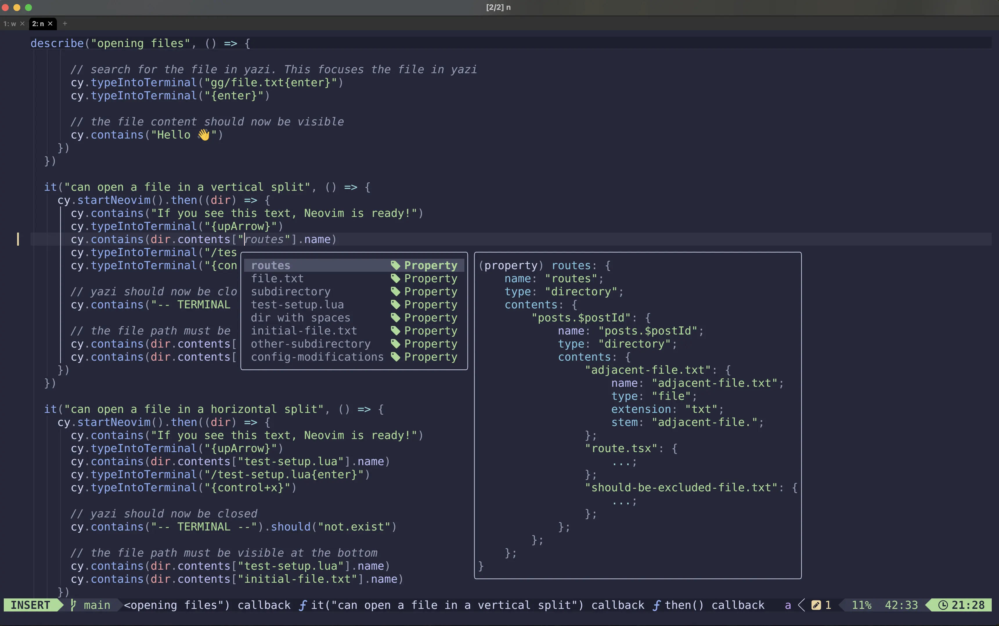

# 🧪 A terminal test environment and development playground 🛝

tui-sandbox is a framework for using the [cypress](https://www.cypress.io/) browser testing tool to run tests against
terminal applications. Currently only [Neovim](https://github.com/neovim/neovim) is supported.

 tests](documentation/images/yazi-example.webp)

> ☝🏻 example of tui-sandbox running Neovim with [yazi.nvim](https://github.com/mikavilpas/yazi.nvim). The yazi.nvim
> Neovim plugin shows the terminal file manager [yazi](https://github.com/sxyazi/yazi/) in a floating window inside
> Neovim, and tests their full integration exactly as a user interacts with them.

## Great use cases

As a developer, you can use tui-sandbox for the following.

### Develop terminal applications in a live environment

The preview is fully interactive. You can use Neovim exactly as you would normally, including mouse clicks.

You can run Neovim inside tui-sandbox and see the changes in your plugin code reflected in the running Neovim instance.
When you update your test, the tests automatically rerun with the latest changes.

You can also isolate the development and testing from your own config

- your own Neovim setup is kept separate from the test environment
- each test has its own Neovim instance
- each test has its own mini directory structure that is type safe. This makes the tests more maintainable and
  discoverable.

> ☝🏻 Neovim using the type-safe test environment provided by tui-sandbox. The language server offers completions for the
> available file paths along with some metadata.

### Write and run integration tests for terminal applications

Using [cypress](https://www.cypress.io/) gives us great features for free, such as:

- automatically waiting for asynchronous things to happen
- make assertions on many things
  - test the terminal colors that are visible
  - images might work too, but I haven't tried them yet 😄
  - emoji are supported 👍🏻
- time travel debugging
- access to screenshots and videos of the test run in case it fails
- type safety with TypeScript

## Limitations

The main limitation is that tui-sandbox is much slower for running tests than a unit testing tool. It trades performance
for the ability to run tests in a live environment (giving very strong guarantees that the tests are valid).

For example, it takes 70 seconds to run 40 test cases in yazi.nvim (1.75s per test). In contrast, it takes 0.21 seconds
to run 110 unit tests in the same project (0.002s per test).

_Note that this is true for any unit/integration test comparison in general, so I recommend using both._
